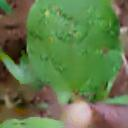
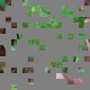
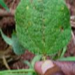

# FCMAE

try to use the fully convolution for masked autoencoder task

## Todo

- [x] GFLOP estimating

## final results

The original picture:

The masked picture:

The recoveried picture:

## references

1. https://arxiv.org/abs/2301.03580 
2. https://arxiv.org/abs/2301.00808 

